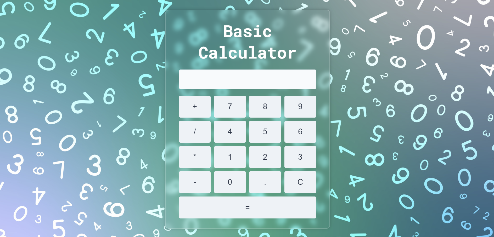

# BasicCalculator
The BasicCalculator project is a simple web-based calculator application built using HTML, CSS, and JavaScript. The primary goal of this project is to create a functional and user-friendly calculator that can perform basic arithmetic operations such as addition, subtraction, multiplication, and division.
 
#### Output
